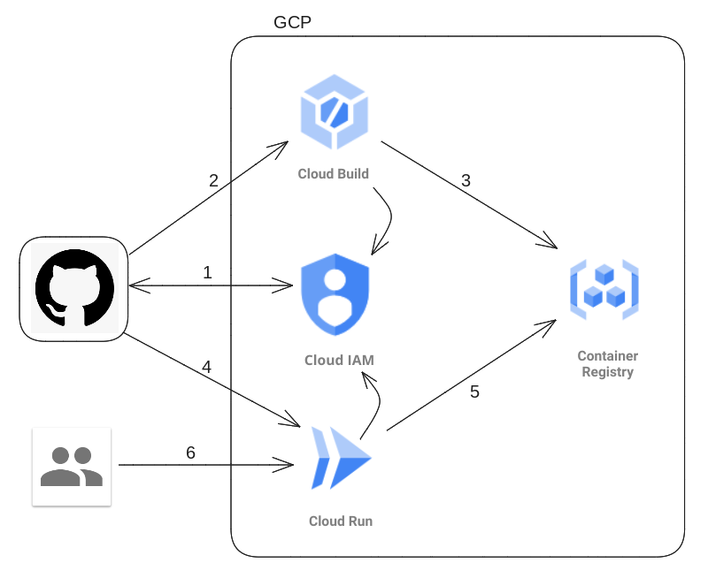

# Workload Identity Federation (WIF)
Simple exmaple showing how one can build and deploy an application in Cloud Run from Github Actions. The build takes place in Cloud Build, and the application is deployed in Cloud Run. All authentication is handled by Cloud IAM and Workload Identity Federation

## Overall architecture




## Project structure
```

.
├── app
│   ├── Dockerfile
│   └── index.html
├── cloudrun.tf
├── config.tf
├── gcr.tf
├── iam.tf
├── README.md
├── terraform.tfvars.json
└── vars.tf

```

## Setup

1. Replace the the project ID. number and default region with your project details under `terraform.tfvars.json`

## Install

1. Run the following command at the root of the folder:
```shell 
$ sudo ./install.sh
$ terraform init
$ terraform plan
$ terraform apply
```

> Note: You may have to run `terraform plan` and `terraform apply` twice if you get errors for serviceaccounts not found

2. Build and deploy the webserver image in GKE, by issuing the following command at the root of the project:

